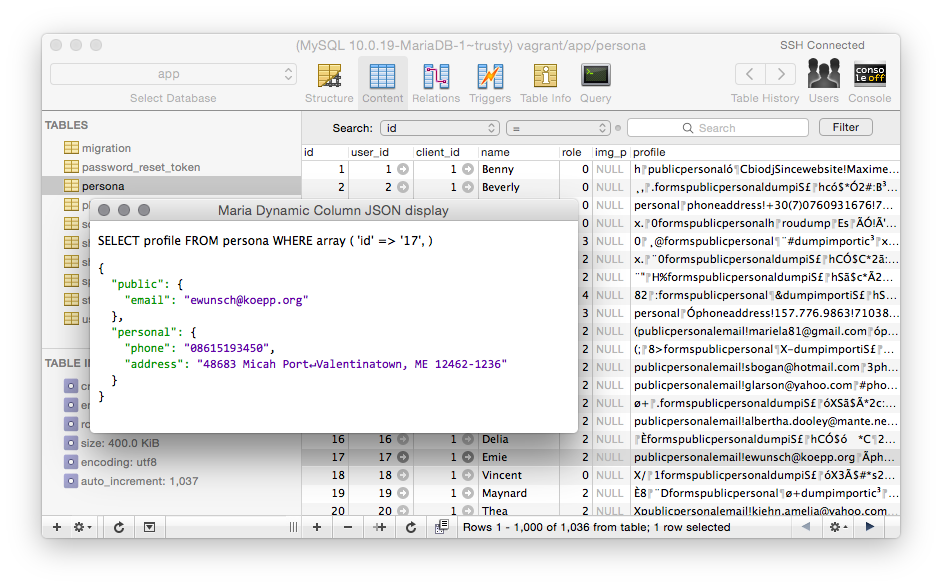
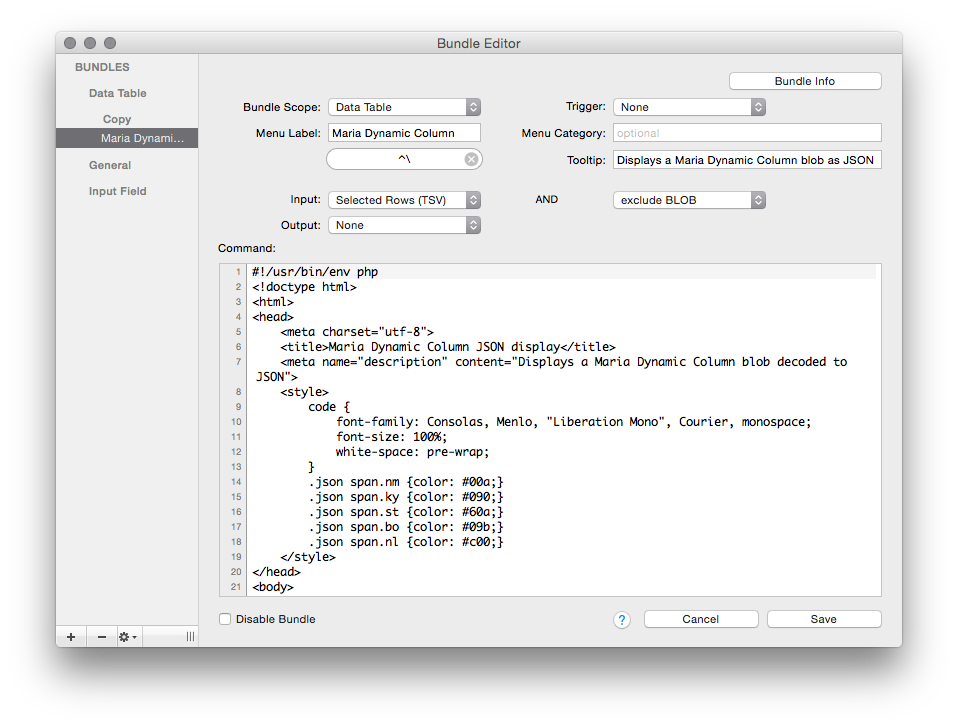

# Manage Maria Dynamic Columns in Sequel Pro

If you use [Dynamic Columns](https://mariadb.com/kb/en/mariadb/dynamic-columns/) in
[Maria 10.0+](https://mariadb.com/kb/en/mariadb/what-is-mariadb-100/)
and the [Sequel Pro](http://sequelpro.com/) MySQL management tool
then you may find this useful.

### Install

- Download Maria Dynamic Column.spBundle
- Save it in `~/Library/Application Support/Sequel Pro/Bundles/`
(In the Finder: ⌘G and enter `~/Library` Navigate from there.)

### Use

Select a row in a table that has a dynamic column blob and run the bundle:

- "Bundles" menu → "Data Table" → "Maria Dynamic Column"
- *or* shortcut key ⌃\ (control-backslash) which you can change by
[hacking](#hack) in the bundle editor.

That's all.

- - -

### For the sophisticated user

It's really very simple if you are used to PHP and MySQL.

#### Hack

Open the bundle editor in Sequel Pro (⌘⎇⌃B), create a bundle and
copy-paste `src/Maria Dynamic Column.php`. Set the
bundle options as show. Now hack!

#### Edit and save

To edit and save the object back in the DB, fork the repo, why not, and
add something [like this](https://github.com/josdejong/jsoneditor/) perhaps to edit
and maybe something [like that](https://github.com/tom--/dynamic-ar/blob/master/DynamicActiveRecord.php#L323-L357)
to save. (PRs welcome ;-)

#### Requires

The bundle requires PHP 5.4+. Apple provides PHP with OS X but yours may be 5.3 or older.
You can install a newer PHP with [homebrew](http://brew.sh/).
It's easy to port this bundle to 5.3 but I haven't done it yet. (PRs welcome ;-)

#### See also

If you use the [Yii 2 Framework](http://www.yiiframework.com/) and Maria Dynamic Columns then try
[yii2-dynamic-ar](https://github.com/tom--/dynamic-ar).

If you use PHP and not Yii, you should at least try out its
[Active Record ORM](http://www.yiiframework.com/doc-2.0/guide-db-active-record.html).
It's really good.

Otherwise, consider extending your favorite ORM for Maria Dynamic Columns to spread the
love of this fine technology.

#### License

[ISC](http://opensource.org/licenses/ISC)

Copyright (c) 2015, Tom Worster <fsb@thefsb.org>

Permission to use, copy, modify, and/or distribute this software for any purpose with or without fee is hereby granted, provided that the above copyright notice and this permission notice appear in all copies.

THE SOFTWARE IS PROVIDED "AS IS" AND THE AUTHOR DISCLAIMS ALL WARRANTIES WITH REGARD TO THIS SOFTWARE INCLUDING ALL IMPLIED WARRANTIES OF MERCHANTABILITY AND FITNESS. IN NO EVENT SHALL THE AUTHOR BE LIABLE FOR ANY SPECIAL, DIRECT, INDIRECT, OR CONSEQUENTIAL DAMAGES OR ANY DAMAGES WHATSOEVER RESULTING FROM LOSS OF USE, DATA OR PROFITS, WHETHER IN AN ACTION OF CONTRACT, NEGLIGENCE OR OTHER TORTIOUS ACTION, ARISING OUT OF OR IN CONNECTION WITH THE USE OR PERFORMANCE OF THIS SOFTWARE.
